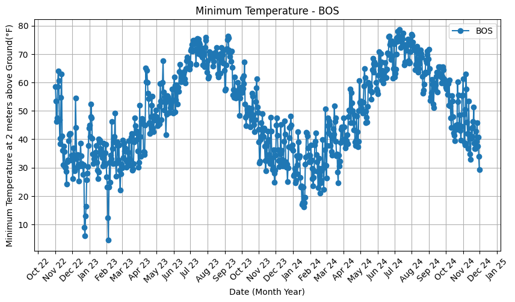
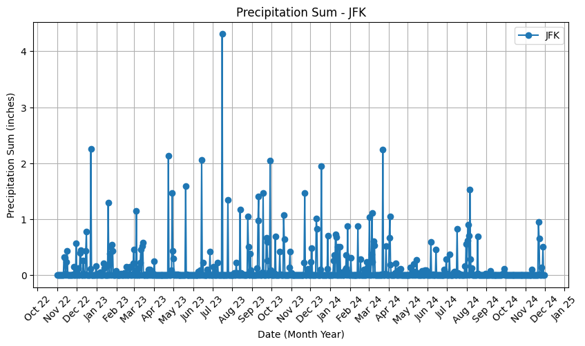
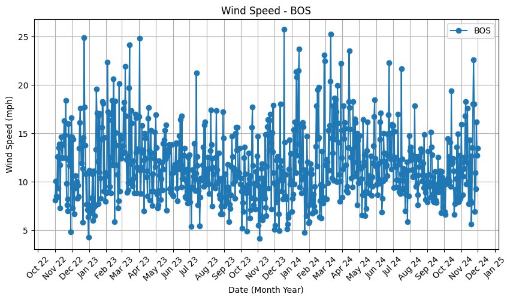
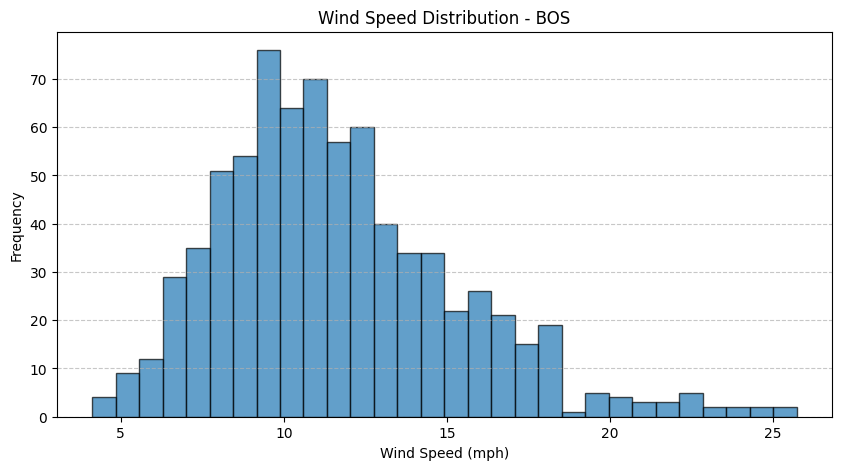
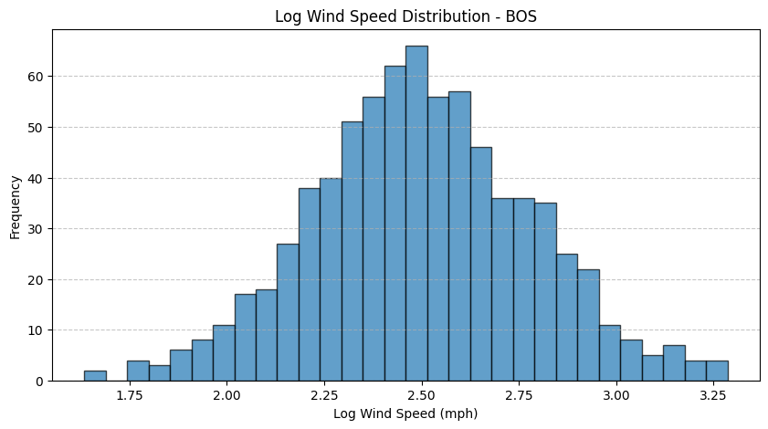

# Data Deliverable

## Data Spec

**dep_delay** :
This is a required integer value that represents the number of minutes that the departure of a given flight was delayed by. A negative value for this variable represents an early departure from the gate.

- In our sample, the earliest departure from the gate was **29 minutes early**, while the latest delay from the airport was **2810 minutes**.
- The mode of the distribution of this column is roughly **0** – this makes sense, since the majority of flights are not delayed.
- This value is **not unique**, and therefore cannot be used to detect any duplicate records. It also does not contain any sensitive information.
- This is going to be **one of the key dependent variables in the analysis**.

---

**dep_delay15**:
This is a **binary variable (1 or 0)** that represents whether or not the departure of a flight was delayed.

- In our sample, there are about **8000 records of flights that were delayed** and **12000 records of flights that were not delayed**, or roughly a **40% proportion** of flights in the sample that were delayed – this is due to the **undersampling of the majority class (non-delayed flights)** that was performed as part of the sample.
- These values **cannot be used to detect any duplicate records**, and do not contain any sensitive information.
- Along with `dep_delay`, this is going to be **one of the main dependent variables in the analysis**.

---

**arr_delay and arr_delay15**:
These are **analogous** to the previous two variables listed (`dep_delay` and `dep_delay15`), but for delays in the **arrival** – this needs to be accounted for in our analysis due to some flights departing on time, but experiencing **delays arriving at the destination** due to unforeseen circumstances.

- In our sample, there are about **7000 records of flights that arrived late** at their destination, or about **35%**.
- In our sample, the **maximum arrival delay** that was experienced was **2807 minutes**, and the **earliest arrival** was **82 minutes early** at the destination.
- Similar to `dep_delay`, the **distribution of `arr_delay` is centered around 0**, as most flights depart and arrive on time.

---

**carrier_delay**:
If a flight is delayed, this is the **number of total minutes of the delay** that can be attributed to **issues with the carrier (the airline) itself**.

- Although this is **not a required value**, we have **filled in any NaN values with `0`**, as any NaN values would indicate that a given flight **did not experience any carrier-related delays**.
- In our sample, the **majority of flights (roughly 15,000 out of 20,000)** do not experience any carrier delays and thus have a `carrier_delay` value of **0**.
- The **longest `carrier_delay`** in our sample is **2807 minutes**, and the **shortest `carrier_delay`** is **0 minutes**.

This should be **a key feature in our analysis** – especially with **some carriers being more reliable than others**, this feature could end up providing **helpful insight** as to which carriers account for the most minutes of flight delays.

---

**weather_delay**:
This variable is **analogous** to the previous `carrier_delay` variable and represents the **total number of minutes** that a flight was delayed that could be attributed to **inclement weather**.

- This is **not a required column**, and any **NaN values have been filled in with `0`** for similar reasons outlined in the `carrier_delay` spec.
- In our sample, the **vast majority of flights (roughly 19,000 out of 20,000)** were **not indicated to have any weather-related delays** and thus have a `weather_delay` value of **0**.
- The **longest weather delay** in our sample was **967 minutes**, and the **shortest weather delay** was **0 minutes**.

This will also be **a key feature in our analysis**, as **inclement weather in the origin or destination of the flight, as well as along the flight path**, should be **very indicative of any potential delays** that could occur.

---

## **precipitation_sum**
This column represents the **total number of inches** as a numeric value of any type of precipitation (**rain, snow, etc.**) recorded for a given day at a specific airport.

- This is a **required column**, with a default value of **0**, indicating **no recorded precipitation**.
- In our sample, **73.9% of days** had **0 inches of precipitation**, leading to a **highly skewed distribution with notable outliers** on days with heavy rainfall or snowfall.
- Each value in this column is **unique**, as it corresponds to the **total precipitation recorded for a specific airport on a given day**.
- This variable is **critical for analysis**, as precipitation levels can significantly impact **flight operations and flight schedules**, potentially contributing to **weather-related delays**.

This feature is expected to be **a key factor in modeling flight delays**, as **heavy precipitation can directly affect takeoffs, landings, and overall airport operations**.

---

## Cleaning Data

### Notable Data Features
**Data collection period:** November 1, 2022 – November 30, 2024

| **Datatable**         | **Single Data Entry Represents** | **Total Datatable Represents** |
|----------------------|--------------------------------|--------------------------------------|
| **Weather Datatable**  | The weather for **one airport on one day**. | The weather for **every airport for every day** over the specified time interval. |
| **Flight Datatable**   | A **specific direct flight** between **Boston (BOS) and one of 29 major domestic airports**. | All **flight connections between BOS and the 29 airports** over the time interval. |
| **Airport Operations Datatable** | The **operations info for a specific day at a specific airport**. | The **operations data for all airports** over the time interval. |

**Flight Data**

-  No values were present for the minutes of each type of delay if there was no delay (or if the flight was early). Therefore, we needed to add a value of 0 in empty columns to indicate that there were 0 minutes of delay for the reasons listed: *Carrier Delay, Weather Delay, NAS delay, Security Delay, Late Aircraft Delay*

**Weather Data**

**1. Handling Precipitation Probability Issues**
- Initially, **missing precipitation probability values (`NaN`) were replaced with `0`** in order to ensure compatible data types for my variable. 
    - At this point I had the wrong assumption that NaN represnted probabilities not calculated due to precipitation being 0 (when I looked at a small variable set)
- After visualizing the data across different airports, it was observed that **all precipitation probability values remained `0` until December 2024**.
 - Upon testing OpenMeteo’s API, it was confirmed that `precipitation_probability_max` was likely introduced as a new metric in **December 2024**.
    - **Decision :** This variable was **removed** to ensure consistency in model training, preventing the model from learning weights on an inconsistent feature.

**2. Wind Direction Normalization**
- Wind direction is represented in **degrees (0° - 360°)**, which can create **weight imbalances** when used as a raw numerical input.
- To address this issue, **wind direction (along with other numerical variables) will be normalized** during preprocessing.
  - This approach provides **greater flexibility** in model tuning and ensures fair weight distribution across features.
  - Importantly, this will allow for testing **different normalization techniques** to evaluate their impact on model performance.

### Notable Data Distributions

The temperature data(both minimum and maximum), follows a seasonal trend, as expected, with high value occuring in the summer and lower values occurring during the winter. We need to be cognisant of this seasonality, and take it into account when preprocessing the data:

The sum values for the different types of precipitation,(precipitation, rain, showers, snowfall) have notable outliers. Since most days have no rain, most data points will have 0 inches of precipitation. On days where precipitation occurs, it tends to be significant(especially compared to the 0 values), therefore, it creates outliers that will need to be dealt with during preprocessing:

The wind speed seems more normally distributed:

But looking at the histogram, it is skewed to the right:

For these, turning it into log values will create regular distributions, which will give us a sense of how to deal with these data values during preprocessing:

### Challenges and Observations

The data collected has interesting variables, with noticeable skews and outliers that could provide great insight for our prediction models. However, these data sets need to be preprocessed effectively and with intent to ensure a model that does not learn biased patterns or misinterpret the relationships between values. As we saw earlier, there are normalization or scaling techniques to create uniform distributions that can be used by the model. Therefore, we must be extremely careful with preprocessing, requiring more time and effort in normalizing the data than previously expected. 

